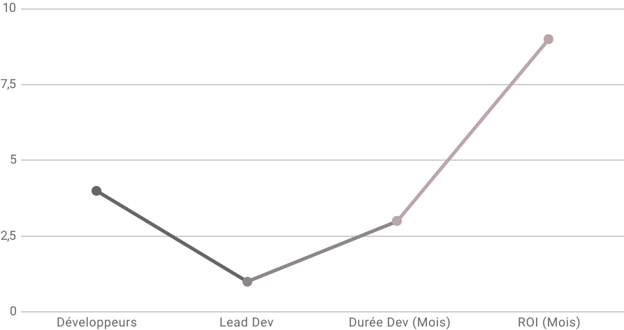

# SportLudique
🏄 A sport e-commerce website

## Contexte

Vendre plus en simplifiant le circuit de vente actuel avec les nouveaux cannaux de vente.

## Acquérir de nouveau marché en ligne.

Les points de ventes physiques voient leur CA (Chiffre d'affaire) baissé depuis plusieurs années.

Le monde du numérique se développe, il représentait 8.4milliards de dollars en 2005 et 81.7en 2017 soit 10 fois plus.

Dans ce contexte la direction souhaite prendre part à ce nouveau marché.

Le mobile quant à lui représente 1/4du marché en ligne aussi il faudra que le site e-commerce soit accessible sur mobiles et tablettes.

## Objectif

L'entreprise SportLudique a vu sonCA baissé de 300 000 € en trois ans l'objectif de l'entreprise et de rattraper ce CA dès la 1ere année.

La boutique en ligne devra être bien référencé afin que chaque type de page (catégorie, fiche produit et accueil) soit dans le top 3 google sur les requêtes ciblées.

Le site devra être responsive, l'UX (expérience utilisateur) doit être harmonieuse entre les supports.

## Description fonctionnelle

Listes des fonctions principales attendues

### Simplifier l'achat en ligne

Un client pourra voir un produit, rechercher un produit ou encore mettre une note et un avis sur un produit qu'il a acheté.

Le responsable du marketing du site pourra ajouter, modifier, supprimer des produits et faire du repporting sur les ventes et produits.

Le chargé d'entrepôt doit pouvoir commander des produits.

Le responsable de l'entrepôt doit être alerté sur les stocks, et pouvoir faire des rapports.

## Budget et Délais

Avec comme objectif avoir un retour sur investissement (ROI) avant Mai.

| La charge de travail est estimé à 4 développeurs dont un lead pour une durée estimé a moins de1 mois. Le retour sur investissement est prévuaprès 9 Mois. | Le planning sera réalisé par le lead dev qui organisera également les taches de chacun L'outil sera développé avec un client lourd. |
| :--: | :--: |