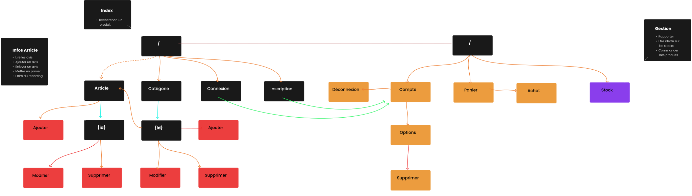

# SportLudique

## CAHIER DES CHARGES

### Un site e-commerce de sport

- _Nom de l’entreprise_: Sport Ludique
- _Nom du projet_: Sport Ludique
- _Client_: Kévin Ferrandon
- _Contact_: BETSCH Victor
- _adresse_: Lycée Fulbert, 28000 Chartres
- _Mail_: contact@victorbetsch.com

## Présentation de l’entreprise

Sport Ludique est un magasin de sport innovant se démarquant des autres. 
Contrairement aux autres, il propose peu d’articles concernant les sports 
“classiques”. L’objectif est de proposer des vêtements ou des accessoires pour 
des sports de tout genre, c’est-à-dire autant pour des sports courants 
(natation, équitation, cyclisme, trail etc) que pour des sports ludiques 
(tir à l’arc, golf, fitness, sports d’hiver).

## Présentation des besoins

L’entreprise subit une chute du chiffre d’affaires, il est nécessaire de le 
remonter afin d’éviter l'effondrement. En vue du marché du numérique 
aujourd’hui, SportLudique compte se lancer sur le web avec un site e-commerce. 
Afin d’être performant et efficace, ce site devra être bien référencé afin de 
toucher le plus de personnes possibles. Il devra également être responsive, 
c’est-à-dire adapté à toutes les plateformes (mobiles, tablettes, ordinateurs
etc).

## Fonctionnalités
Les visiteurs du site pourront voir tous les produits classés selon les 
catégories ou en rechercher un. S’ils veulent ajouter un produit à leur panier, 
ou alors mettre une note ou un avis, ils devront être client, c’est-à-dire créer
un compte.

Du côté entreprise, le responsable du marketing est chargé de gérer (ajouter, 
modifier et supprimer) les produits. Il aura également la possibilité de faire 
du reporting sur les ventes et produits. Le responsable de l’entrepôt sera 
alerté sur les stocks et pourra faire des rapports. Quant au chargé d’entrepôt, 
il pourra commander des produits afin de remplir le stock.

## Use case 
<!-- TODO: Add image -->

## Mapping

## MCD
<!-- TODO: Add mcd -->

## Charte Graphique
<!-- TODO: Add graphical specs -->

## Mockup
<!-- TDO: Add Mockup -->

## Planning
Tâches à faire avec dates approximatives:

- [x] `23/09` Création du projet Github
- [x] `30/09` Organisation du projet sur Trello
  - Création du cahier des charges
  - (présentation, besoins)

- [x] `07/10` Création de l'Use Case
  - Organisation Planning & Budget

- [] `14/10` Création de la BDD (MCD, MLD, SQL)
  - Création de la Mockup et de la Charte Graphique
  - Création du sitemap du site
  - Finir le cahier des charges

## Budget
Application web de base prévue pour fin décembre:

**Salaire des membres:**
- Victor, Chef de projet: **2000€** - **13.61€ / h**
- Yohann: **1 555 €** / mois - **10.25€ / h**
- Kylian: **1 555 €** / mois - **10.25€ / h** - *En renfort*
- Nathan: **1 555 €** / mois - **10.25€ / h** - *En renfort*

